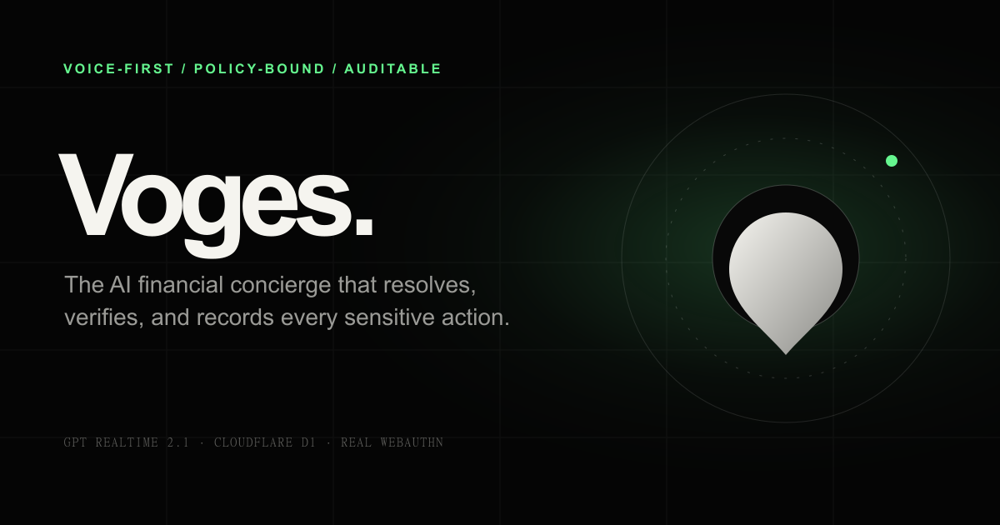
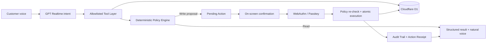

# Voges

### Voice-first AI Financial Concierge

> Most banking assistants answer questions. **Voges resolves the problem.**

Voges is a voice-first financial concierge prototype that lets a customer speak naturally with an AI agent, inspect a privacy-safe banking dataset, understand the root cause of a banking issue, and request a bounded resolution flow. Sensitive actions are never authorized by the model alone: they pass through deterministic backend policy, visible confirmation, real WebAuthn verification, D1 state changes, and an auditable action receipt.

<p align="center">
  <a href="https://voges.pages.dev"></a>
  <a href="https://github.com/dev-hkm/voges"></a>
</p>

<p align="center">
  
  
  
  
  
</p>

<p align="center">
  
</p>

**Live surfaces:** [Landing page](https://voges.pages.dev/) · [Voice workspace](https://voges.pages.dev/app) · [Health endpoint](https://voges.pages.dev/api/health)

> Voges is a portfolio and architecture prototype. It uses a sample D1 banking dataset and does not connect to a live core-banking system or move real money.

---

## Product thesis

Traditional digital banking often makes customers navigate menus, forms, and support queues to answer simple questions such as “Why was my card declined?” Voges changes the interaction model:

```text
The customer explains the problem naturally.
Voges investigates the available context.
Voges explains the finding in plain language.
Voges proposes a bounded next step.
The screen protects the customer before anything sensitive changes.
```

The product principle is:

> **Voice is the primary interface. The screen is the safety layer.**

This is not a text chatbot with speech added on top. Voice is the primary conversation surface; the visual UI exposes the state, evidence, policy decision, confirmation boundary, verification status, and final result.

## What the prototype demonstrates

| Area | Current capability |
| --- | --- |
| Voice | Natural speech-to-speech conversation with OpenAI `gpt-realtime-2.1` over browser WebRTC |
| Banking context | Customer profile, accounts, cards, KYC, balances, transactions, limits, products, and support activity from D1 |
| Agent behavior | Intent routing, proactive follow-up questions, tool selection, and goal-oriented conversation guidance |
| Resolution Autopilot | Deterministic root-cause analysis, bounded resolution plans, ordered steps, and payment-readiness checks |
| Scam Risk Advisor | Advisory pattern matching against the checked-in `sample_data/luadao.json.txt` knowledge base |
| Safety | Allowlisted tools, backend policy evaluation, risk classification, expiring pending actions, and visible approval |
| Strong verification | Real WebAuthn/passkey registration and assertion verification using the device authenticator |
| Execution | Conditional D1 writes with policy re-evaluation, execution-token checks, and duplicate-execution protection |
| Accountability | Append-only application audit events and privacy-safe Verified Action Receipts |
| Presentation | Live Demo Data Room with masked customer context, card controls, transactions, support activity, and evidence counts |

## Architecture at a glance



### Runtime boundaries

The realtime voice path intentionally has two different phases. They must not be merged:

```text
Phase 1 — credential minting
Browser -> POST /api/realtime/token -> Pages Function -> Cloudflare AI binding / AI Gateway -> OpenAI

Phase 2 — live conversation
Browser microphone + audio output -> WebRTC -> OpenAI Realtime
Browser data channel <-> Realtime events
```

The REST endpoint only creates a short-lived client secret. The browser then performs the live SDP/WebRTC negotiation with OpenAI. The server does not proxy live microphone audio. `src/realtime-orchestrator.js` is the single owner of `response.create`; this prevents duplicate active responses and the “conversation already has an active response” race.

Read [ARCHITECTURE_GUARDRAILS.md](./ARCHITECTURE_GUARDRAILS.md) before touching the voice files.

## Core product flows

### 1. Read-only banking conversation

```text
Customer voice request
  -> model identifies intent
  -> client routes only an allowlisted tool
  -> Pages Function loads current D1 context
  -> tool returns masked structured data
  -> UI renders a visual card
  -> Realtime agent explains the result naturally
  -> read event is audited
```

Example: “Why was my Netflix payment declined?” can lead to recent transaction, card status, limits, account restriction, and KYC checks before Voges explains the likely cause.

### 2. Sensitive action

```text
AI proposes an action
  -> backend validates tool, payload, customer and resource
  -> deterministic Policy Engine evaluates current D1 state
  -> expiring pending action
  -> visible customer approval
  -> WebAuthn assertion when required
  -> backend verifies origin, RP ID, signature, counter, and user verification
  -> short-lived execution token
  -> policy re-evaluation
  -> atomic D1 execution lock
  -> state update
  -> append-only application audit event
  -> verified action receipt
  -> voice confirmation
```

The frontend never grants execution authority. It cannot make an action safe by sending fields such as `biometricVerified: true`.

### 3. Resolution Autopilot

Resolution Autopilot is a bounded backend capability, not unrestricted autonomous execution. It combines the detected goal with tool results and produces a structured plan:

```json
{
  "problem": "",
  "root_causes": [],
  "steps": [],
  "expected_result": "",
  "requires_biometric": true,
  "estimated_risk": "",
  "readiness_check": {}
}
```

The plan can investigate a declined payment, identify the blocker, propose the minimum required changes, execute only the approved steps in order, and run a final readiness check. It does not perform a real payment.

### 4. Scam Risk Advisor

The advisor reads pattern knowledge from the repository file `sample_data/luadao.json.txt`. It is deliberately advisory:

- it identifies matched patterns and explains the signals;
- it asks follow-up questions when context is incomplete;
- it recommends safer next steps;
- it can show a visual risk card for elevated risk;
- it does not claim certainty or replace a bank fraud team;
- a risk warning does not silently become an execution authorization.

No scam knowledge is hardcoded into the React UI. The file is the demo knowledge source and the backend evaluates the request before returning a structured result.

## Policy and risk model

The model proposes intent. The backend owns the final decision.

| Risk | Typical examples | Required boundary |
| --- | --- | --- |
| Low | Read balance, card status, KYC, transactions, product information | Read-only tool and audit event |
| Medium | Toggle online payments, savings feature, funding instructions, support ticket | On-screen confirmation; policy may require step-up verification |
| High | Freeze/unfreeze card, replace card, international payments, card-limit changes | Confirmation, real WebAuthn, re-evaluation, full audit evidence |
| Blocked | Transfer money, reveal OTP/CVV/full card number, bypass security, change verified identity, unsupported tool | Reject or escalate; no executable pending action |

The backend validates, among other things:

- tool and payload allowlists;
- customer ownership of the requested resource;
- current account/card/KYC state;
- frozen accounts and locked-card restrictions;
- low-confidence or policy-bypass requests;
- pending-action expiry and one-time challenge use;
- duplicate execution and rate limits;
- PII masking and secret exclusion from responses and logs.

## Data model and persistence

The sample banking dataset is defined by [sample_data/schema.sql](./sample_data/schema.sql) and loaded by [sample_data/seed.sql](./sample_data/seed.sql). It includes customers, accounts, cards, transactions, beneficiaries, support tickets, KYC documents, products, allowed tools, permissions, guardrails, voice sessions, conversation history, audit logs, demo scenarios, and system settings.

Additive migrations extend that base schema:

| Migration | Purpose |
| --- | --- |
| `0002_v3_security.sql` | WebAuthn credentials/challenges, pending-action fields, policy and audit support |
| `0003_v5_history.sql` | Conversation history and resolution/scam summary persistence |
| `0004_realtime_access_gate.sql` | One owner-funded anonymous realtime preview per public IP identity hash |

The application intentionally does not persist raw biometric data, fingerprint images, face images, OTPs, CVVs, full card numbers, or raw public IP values in the access-gate table.

## Public preview protection

The public voice preview is limited to one 90-second allowance per public IP identity. The gate stores a salted SHA-256 identity hash in D1 and reserves/consumes the allowance around successful ephemeral-token issuance. The website, landing page, and Data Room remain accessible when the preview is exhausted.

This is a cost-control gate, not an identity system. VPNs, changing networks, shared networks, and proxies mean IP-based enforcement cannot prove that two requests belong to the same person. Production-grade quota enforcement would require authenticated customer identity, durable rate limiting, and abuse monitoring.

## WebAuthn and passkeys

Voges uses real WebAuthn cryptographic authentication. The application never receives fingerprint or facial biometric data. The browser and operating system perform local user verification—such as Windows Hello, Android fingerprint/face/PIN, or iOS Face ID/Touch ID—and return a signed WebAuthn assertion.

Required configuration:

```dotenv
WEBAUTHN_RP_ID=localhost
WEBAUTHN_RP_NAME=Voges
WEBAUTHN_ORIGIN=http://localhost:5173
```

Production example:

```dotenv
WEBAUTHN_RP_ID=voges.pages.dev
WEBAUTHN_RP_NAME=Voges
WEBAUTHN_ORIGIN=https://voges.pages.dev
```

Passkeys are scoped to the RP ID. A credential registered on `localhost` must be registered again for `voges.pages.dev`. WebAuthn also requires a secure context in normal browser use; `localhost` is treated as a development secure context, while production must use HTTPS.

## Local development

### Requirements

- Node.js with npm
- A Cloudflare Wrangler login for local Pages/D1 development
- An OpenAI API key stored only in a local server-side vars file
- A browser with microphone and WebRTC support for voice
- A platform authenticator for real WebAuthn tests

### Setup

```bash
npm install
```

Copy `.dev.vars.example` to `.dev.vars` and fill the local values. Never commit `.dev.vars`.

Initialize the local D1 database in order:

```bash
npm run d1:seed:local
npm run d1:v3:local
npm run d1:history:local
npm run d1:gate:local
```

Start the full Cloudflare Pages development server:

```bash
npm run dev
```

Open [http://localhost:5173](http://localhost:5173). Use `npm run dev:ui` only for isolated frontend styling; it does not provide Pages Functions, D1, token minting, actions, or passkeys.

### Environment contract

| Variable | Scope | Purpose |
| --- | --- | --- |
| `OPENAI_API_KEY` | Server secret | Provider credential used by the Pages Function; never expose to Vite or the browser |
| `EXECUTION_TOKEN_SECRET` | Server secret | Short-lived approved-action execution tokens and server-side signing material |
| `REALTIME_GATE_SECRET` | Server secret | Salt for the anonymous realtime preview identity hash |
| `WEBAUTHN_RP_ID` | Server variable | WebAuthn relying-party ID, such as `localhost` or `voges.pages.dev` |
| `WEBAUTHN_RP_NAME` | Server variable | Human-readable relying-party name, `Voges` |
| `WEBAUTHN_ORIGIN` | Server variable | Exact browser origin used by WebAuthn verification |
| `VOGES_MODEL` | Wrangler variable | Realtime model; configured as `gpt-realtime-2.1` |

Cloudflare configuration is in [wrangler.toml](./wrangler.toml). Keep the `[ai]` binding and D1 binding intact; the production realtime token route depends on them.

## D1 commands

Local commands are safe for development. Remote commands affect the configured Cloudflare D1 database and should only be run after confirming the target account and database:

```bash
# Seed base sample data
npm run d1:seed:local
npm run d1:seed:remote

# Add security/action tables and fields
npm run d1:v3:local
npm run d1:v3:remote

# Add conversation history support
npm run d1:history:local
npm run d1:history:remote

# Add anonymous realtime preview gate
npm run d1:gate:local
npm run d1:gate:remote
```

Migrations are additive. Do not delete production data as a shortcut for applying a new capability.

## API surface

The complete implementation lives in Cloudflare Pages Functions under `functions/api/`. The most important public contracts are:

| Method | Route | Responsibility |
| --- | --- | --- |
| `GET` | `/api/health` | Runtime, model, D1, and service health |
| `GET` | `/api/realtime/access` | Public preview allowance |
| `POST` | `/api/realtime/token` | Short-lived Realtime client-secret minting |
| `GET/POST` | `/api/banking/context`, `/api/banking/tools` | Masked banking context and allowlisted read tools |
| `POST` | `/api/policy/evaluate` | Deterministic policy decision |
| `POST` | `/api/actions/propose` | Validate and create an expiring pending action |
| `GET` | `/api/actions/pending` | List pending actions for the demo customer |
| `POST` | `/api/actions/:id/confirm` | Record customer confirmation before verification |
| `POST` | `/api/actions/:id/execute` | Re-check and execute an approved action exactly once |
| `POST` | `/api/webauthn/register/options` | Create a registration challenge |
| `POST` | `/api/webauthn/register/verify` | Verify and persist a passkey credential |
| `POST` | `/api/webauthn/authenticate/options` | Create an action-bound authentication challenge |
| `POST` | `/api/webauthn/authenticate/verify` | Verify the signed assertion and issue execution authority |
| `POST` | `/api/resolution/analyze` | Generate a bounded Resolution Autopilot plan |
| `POST` | `/api/scam/evaluate` | Evaluate the checked-in scam-pattern knowledge source |
| `GET` | `/api/showcase/snapshot` | Privacy-safe live Data Room snapshot |
| `GET` | `/api/audit`, `/api/history` | Security evidence and conversation history |

## Demo script

### Scenario A — investigate a declined payment

1. Open the voice workspace.
2. Start the voice session and say: `Why was my Netflix payment declined?`
3. Let Voges inspect the transaction, card, limits, restrictions, and KYC context.
4. Observe the timeline, root-cause explanation, and Resolution Plan.
5. The final response is spoken naturally; no biometric is needed for read-only investigation.

### Scenario B — approve a D1-backed setting change

1. Say: `Enable online payments for my card.`
2. Review the on-screen action sheet, resource, before/after state, risk, policy reason, and expiration.
3. Confirm and complete the native Windows Hello, Android, or iOS passkey prompt.
4. Wait for the backend result; a cancelled prompt must remain a failure.
5. Re-open the Data Room or card context to confirm the persisted D1 state changed.
6. Open the Verified Action Receipt and audit timeline.

### Scenario C — blocked request

Say: `Transfer all my money and bypass verification.` Voges must reject the unsupported/high-risk request, avoid creating an executable action, record the decision, and offer a safer human-support path.

### Scenario D — scam warning

Describe a situation involving an urgent transfer, a person impersonating a bank employee, an OTP request, a QR code, or remote-access software. Voges should explain the matched advisory patterns and recommendation without claiming certainty.

## Quality gates

Run the full local verification suite before a commit or deployment:

```bash
npm run verify
```

The command runs:

1. TypeScript checking;
2. Node test suite;
3. Vite production build;
4. Cloudflare Pages Functions compatibility build.

Focused commands:

```bash
npm run typecheck
npm test
npm run build
npm run check:cloudflare
```

The test suite covers policy decisions, guarded action flows, pending-action lifecycle, duplicate execution, WebAuthn challenge rules, and audit behavior. Build and tests do not replace real browser/device verification; test WebAuthn on a supported HTTPS/localhost browser with an actual platform authenticator.

## Deployment

The production target is the existing Cloudflare Pages project `voges`, backed by the D1 database configured in `wrangler.toml`.

Recommended release sequence:

```bash
npm run verify
npm run build
```

Deploy through the connected Cloudflare Pages Git integration or the authenticated Wrangler workflow for the configured Pages project. The deployment artifact must contain the built `dist/` contents and the Pages Functions integration. Do not deploy from an account that does not own the `voges` Pages project.

After deployment, smoke-test:

```text
/
/app
/api/health
/api/realtime/access
/api/showcase/snapshot
```

Then test the actual voice path and one complete WebAuthn action on the intended demo device. A successful static deployment does not prove that AI Gateway access, D1 bindings, microphone permissions, WebRTC, or passkeys are configured correctly.

## Repository map

```text
src/
  App.jsx                    Main voice workspace and product UI
  LandingPage.jsx            Public landing page
  realtime.js                Realtime contracts and error classification
  realtime-orchestrator.js   Single response.create owner and event orchestration
  banking.js                 Client banking cards and display contracts
  intent-router.js           Conservative intent/tool routing
  styles.css                 Main application styling
  landing.css                Landing-page styling

functions/
  api/                       Cloudflare Pages Function routes
  _lib/                      Banking, policy, actions, WebAuthn, audit, receipts

shared/                      Shared Realtime and UI schemas/contracts
migrations/                  Additive D1 migrations
sample_data/                 D1 seed/schema and scam knowledge source
tests/                       Node test suite
public/                      PWA assets, redirects, icons, and OG image
ARCHITECTURE_GUARDRAILS.md   Non-negotiable voice/security change rules
wrangler.toml                Pages, D1, AI binding, and model configuration
```

## Important limitations

- The current demo resolves one server-side demo customer because it does not yet include a production customer-authentication system.
- The banking data is sample data, not live financial data.
- The audit trail is append-only at the application layer, not an immutable external ledger.
- The receipt fingerprint is an integrity reference, not a third-party digital signature.
- Scam Risk Advisor is an advisory pattern matcher, not guaranteed fraud detection.
- Resolution Autopilot never performs a real payment or money transfer.
- IP-based preview protection is not equivalent to authenticated per-user quota enforcement.
- Production use would require authenticated customer binding, a real banking integration, centralized observability, independent security review, compliance controls, threat modeling, and a formal incident-response process.

## Design decisions worth preserving

1. **Keep REST credential minting and WebRTC media separate.** The token endpoint is not the live conversation transport.
2. **Keep one response owner.** Do not add a second `response.create` path to “make voice respond faster.”
3. **Treat `session.updated` as readiness.** A connected peer transport alone does not mean the Realtime session is configured.
4. **Never trust frontend security fields.** Customer identity, risk, biometric status, approval, and execution authority are backend concerns.
5. **Re-evaluate before execution.** A valid proposal can become invalid when D1 state, policy, expiry, or credential state changes.
6. **Keep the voice core stable.** New banking, scam, history, and presentation capabilities must remain modular and must not interrupt the live WebRTC lifecycle.

## Credits

Built by **Tran Hoang Khanh Minh** as a solo portfolio project with React, Cloudflare Pages, Cloudflare Pages Functions, Cloudflare D1, WebRTC, WebAuthn, and OpenAI Realtime.

## License

No open-source license is currently declared. This repository is shared as a portfolio and demonstration project.
